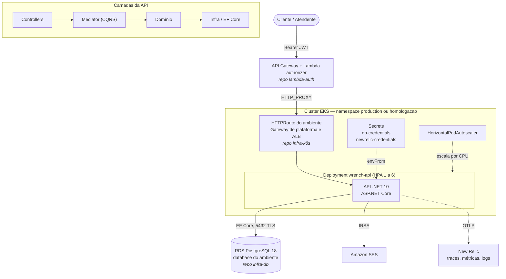

<div align="center">


# app-k8s — Wrench Auto Repair

**Aplicação principal** do Projeto Chave Inglesa: a API .NET que roda no cluster EKS, com o chart
Helm que a implanta e a documentação de arquitetura do sistema.


FIAP · Pós-Tech · 13SOAT · Tech Challenge Fase 3 · Grupo **BGT³**

[**📚 API (OpenAPI/Scalar)**](https://api.bgt3.com.br/docs-ui) &nbsp;·&nbsp;
[**📦 Postman**](./docs/postman/wrench.postman_collection.json) &nbsp;·&nbsp;
[**🗂️ C4 Model**](https://structurizr-wrench-api.bgt3.com.br/workspace/1) &nbsp;·&nbsp;
[**🏛️ Arquitetura**](./docs/infraestrutura/arquitetura.md)

</div>

---

## Propósito

Este repositório contém **a aplicação**: o código .NET dos quatro bounded contexts, os testes, o
chart Helm que a publica no cluster e a documentação arquitetural do sistema. A infraestrutura, o
banco e a borda autenticada vivem em repositórios separados — ver
[Onde está cada coisa](#onde-está-cada-coisa).

O domínio é a operação de uma oficina mecânica: cadastro de clientes e veículos, controle de
estoque de peças e o ciclo de vida da ordem de serviço (recebida → diagnóstico → aguardando
aprovação → em execução → finalizada → entregue). A visão completa do negócio está em
[`docs/visao-geral.md`](./docs/visao-geral.md).

## Arquitetura deste repositório



### Bounded contexts

| Contexto | Responsabilidade |
|---|---|
| `autenticacao` | Usuários, perfis, política de senha e login por e-mail e senha |
| `cadastro` | Clientes, veículos e endereços |
| `estoque` | Peças, saldo e reposição |
| `ordem.servico` | Ordem de serviço, diagnóstico, orçamento, execução e métricas por fase |

Cada contexto se divide em `domain`, `application` e `infra`; `wrench.auto.repair.core` concentra
os objetos compartilhados (value objects, `Result`, mediator, validações) e `wrench.web.api` é o
host HTTP, com autenticação JWT, telemetria e healthchecks.

## Tecnologias

| Camada | Stack |
|---|---|
| Aplicação | .NET 10, ASP.NET Core, C# |
| Padrões | DDD, CQRS com MediatR, Repository, Unit of Work |
| Persistência | Entity Framework Core 10, Npgsql, PostgreSQL 18 (RDS) |
| Validação | FluentValidation, DocsBRValidator |
| Autenticação | JWT Bearer (HS256), emitido pela Lambda `lambda-auth` ou pelo login por e-mail e senha |
| Observabilidade | Serilog (JSON), OpenTelemetry, OTLP para New Relic |
| Documentação de API | OpenAPI + Scalar (`/docs-ui`) |
| Testes | xUnit, Moq, FluentAssertions, Bogus, Testcontainers |
| Empacotamento | Docker, Helm |
| CI/CD | GitHub Actions |

## Onde está cada coisa

| Repositório | Conteúdo |
|---|---|
| **app-k8s** (este) | API .NET, testes, chart Helm, documentação de arquitetura |
| `lambda-auth` | Lambda de autenticação por CPF, Lambda authorizer e API Gateway |
| `infra-k8s` | Terraform da VPC, EKS, ACM, ECR, DNS, SES e Structurizr; `nri-bundle`; dashboards, alertas e synthetic monitor do New Relic |
| `infra-db` | Terraform do RDS PostgreSQL, do role da aplicação e do role somente leitura da Lambda |

## Autenticação e acesso

As rotas `/api` são consumidas pelo API Gateway do repositório `lambda-auth`, que valida o token
antes de encaminhar ao ALB. A API revalida o token e aplica a role de cada endpoint.

| Como obter o token | Perfil | Uso típico |
|---|---|---|
| `POST /auth/cpf` no API Gateway, com o CPF do cliente | `Cliente` | aprovar ou recusar orçamento, acompanhar ordens |
| `POST /api/v1/autenticacao` com e-mail e senha | `Admin` ou `Funcionario` | cadastros, estoque, abertura e gestão de ordens |

O token emitido pela Lambda e o emitido pela API são intercambiáveis: mesmo `Issuer`, `Audience`,
chave de assinatura e claims. A Lambda lê somente `Clientes(Id, Documento, Email)`,
`Usuarios(Id, Email, PerfilId, Ativo)` e `Perfis(Id, Nome)`; o teste de contrato do pipeline falha
se uma migration alterar essas colunas. Detalhes em
[ADR 005](./docs/adrs/ADR%20005%20-%20Padrao%20de%20Comunicacao.md) e no
[diagrama de sequência da autenticação](./docs/diagramas/sequencia-autenticacao.md).

## Como executar

### Local (Docker Compose)

Nenhum segredo é versionado, então a primeira execução exige preencher o `.env`:

```bash
cp .env.example .env
# gere a chave de assinatura do JWT e defina a senha do admin
openssl rand -hex 32   # cole em JWT_SIGNING_KEY

docker compose -f wrench.auto.repair/scripts/docker-compose.yml up -d
```

O Compose falha imediatamente se `JWT_SIGNING_KEY` ou `ADMIN_PASSWORD` estiverem vazios — a
aplicação também recusa subir sem chave de assinatura configurada. A documentação fica em
`http://localhost:8080/docs-ui`. Os logs saem em JSON no console; para exportá-los ao New Relic,
defina `OTEL_EXPORTER_OTLP_ENDPOINT`, `OTEL_EXPORTER_OTLP_PROTOCOL` e `OTEL_EXPORTER_OTLP_HEADERS`
na sessão.

### Testes

```bash
cd wrench.auto.repair

# unitários
dotnet test wrench.auto.repair.sln --filter "FullyQualifiedName!~integration"

# integração e contrato do banco (exige Docker: sobem containers via Testcontainers)
dotnet test wrench.auto.repair.sln
```

### Auditoria de dependências

O mesmo comando que o pipeline executa — o build falha se houver vulnerabilidade conhecida:

```bash
dotnet list wrench.auto.repair.sln package --vulnerable --include-transitive
```

## Segredos

A aplicação **não carrega nenhum segredo do repositório**. Todos vêm de fora:

| Configuração | Produção | Local |
|---|---|---|
| `JwtOptions:Secret` | secret `JWT_SIGNING_KEY` → chart → `Secret` do Kubernetes | `.env` |
| `ADMIN_PASSWORD` | secret `ADMIN_PASSWORD` → chart | `.env` |
| `ConnectionStrings:Database` | montada pelo chart a partir dos outputs de infra e do secret do role da aplicação | `appsettings.Development.json` (Postgres local) |
| `OTEL_EXPORTER_OTLP_*` | secret `NEW_RELIC_LICENSE_KEY` → chart → `newrelic-credentials` | variáveis da sessão |
| Credenciais AWS | role IRSA na `ServiceAccount` — sem chave estática | perfil local do AWS CLI |

`appsettings.json` traz apenas os valores não sensíveis; `JwtOptions:Secret` e
`ConnectionStrings:Database` ficam vazios e são sobrescritos por variável de ambiente
(`JwtOptions__Secret`, `ConnectionStrings__Database`). Se a chave de assinatura não chegar,
`ConfigureAuthentication` lança na inicialização em vez de subir com autenticação quebrada.

## Deploy

### Pipeline

| Gatilho | O que acontece |
|---|---|
| Pull request para `master` ou `develop` | Build, auditoria de vulnerabilidades, testes, `helm lint` e `helm template` |
| Push em `develop` | Build e testes, depois deploy em **homologação** (namespace `homologacao`, `hml-api.bgt3.com.br`, database `wrench_auto_repair_hml`) |
| Push em `master` | Build e testes, depois deploy em **produção** (namespace `production`, `api.bgt3.com.br`, database `wrench_auto_repair`) |
| *Run workflow* do `ci-cd.yml` em `develop` ou `master` | O mesmo deploy da branch, sem novo commit; usado pelo Orquestrador de Provisionamento do `infra-k8s` |
| *Run workflow* do `destroy.yml` em `develop` ou `master`, com confirmação `DESTRUIR` | Remove o release e o namespace do ambiente da branch; usado pelo Orquestrador de Destruição do `infra-k8s` |

O deploy calcula a próxima versão semântica a partir dos commits, constrói e publica a imagem no
ECR, empacota e publica o chart, aplica com `helm upgrade --install` no namespace do ambiente e
aguarda o rollout do deployment e a aceitação da `HTTPRoute` pelo Gateway de plataforma
`gateway/bgt3-gw`, criado pelo `infra-k8s`. A branch `master` é protegida e só recebe alterações por Pull Request.

### Ambientes

| | Homologação | Produção |
|---|---|---|
| Branch | `develop` | `master` |
| Namespace e release Helm | `homologacao`, `wrench-hml` | `production`, `wrench` |
| Hostname | `hml-api.bgt3.com.br` | `api.bgt3.com.br` |
| Database no RDS | `wrench_auto_repair_hml` | `wrench_auto_repair` |

Os dois ambientes compartilham cluster, Gateway de plataforma, ALB e instância RDS, e ficam
separados por namespace, hostname e database ([ADR 004](./docs/adrs/ADR%20004%20-%20Uso%20de%20HPA.md)).

### Valores de infraestrutura

O job de deploy lê os states publicados pelo `infra-k8s` e pelo `infra-db` através de
[`.github/terraform-outputs`](./.github/terraform-outputs/main.tf), um módulo que só faz
`terraform_remote_state` e reexpõe os campos necessários ao `helm upgrade`.

### Variáveis e secrets

| Nome | Tipo | Descrição |
|---|---|---|
| `AWS_ACCESS_KEY_ID` / `AWS_SECRET_ACCESS_KEY` | secret | Credenciais de deploy |
| `AWS_REGION` | variable | Região AWS |
| `TF_API_TOKEN` | secret | Token do HCP Terraform (leitura dos states de infra) |
| `TFC_ORGANIZATION` | variable | Organização no HCP (`bgt3`) |
| `TFC_WORKSPACE_INFRA` | variable | Workspace do `infra-k8s` (`wrench_auto_repair`) |
| `TFC_WORKSPACE_RDS` | variable | Workspace do stack `rds/` do `infra-db` (`wrench_auto_repair_rds`) |
| `TFC_WORKSPACE_EMAIL` | variable | Workspace do stack `email/` (`wrench_auto_repair_email`) |
| `TFC_WORKSPACE_ECR` | variable | Workspace do stack `ecr/` (`wrench_auto_repair_ecr`) |
| `APPLICATION_DATABASE_USERNAME` / `APPLICATION_DB_PASSWORD` | secret | Role de menor privilégio da aplicação no RDS |
| `ADMIN_EMAIL` | variable | E-mail do usuário administrador semeado |
| `ADMIN_PASSWORD` | secret | Senha do administrador — **não versionada** |
| `JWT_ISSUER` / `JWT_AUDIENCE` | variable | Emissor e audiência do token — idênticos aos do `lambda-auth` |
| `JWT_SIGNING_KEY` | secret | Chave de assinatura do JWT — **não versionada**, compartilhada com o `lambda-auth` |
| `NEW_RELIC_LICENSE_KEY` | secret | Ingest license key do New Relic |
| `NO_REPLY_EMAIL` | secret | Remetente das notificações via SES |
| `AWS_ACCESS_KEY_ID_SES` / `AWS_SECRET_ACCESS_KEY_SES` | secret | Credenciais usadas nos testes |

Os ambientes `production` e `homologacao` devem existir em **Settings → Environments**.

## Observabilidade

| Sinal | Implementação |
|---|---|
| Logs estruturados | Serilog em JSON no stdout e via OTLP, com `CorrelationId` (`X-Correlation-ID`), `TraceId` e `SpanId` |
| Traces | OpenTelemetry para ASP.NET Core, HttpClient e EF Core; `/health` fora do tracing |
| Métricas de negócio | `ordemservico.diagnostico.duration`, `ordemservico.execucao.duration`, `ordemservico.entrega.duration` e `ordemservico.processamento.falhas` |
| Métricas de runtime | OpenTelemetry Runtime e ASP.NET Core |
| Destino | New Relic via OTLP (`otlp.nr-data.net`), com a license key do secret `newrelic-credentials` |

Os dashboards, os alertas e o synthetic monitor são provisionados pelo `infra-k8s`. Queries e
decisões em [dashboards NRQL](./docs/observability/dashboards-nrql.md) e no
[ADR 003](./docs/adrs/ADR%20003%20-%20Observabilidade%20com%20New%20Relic.md).

## Healthchecks

| Endpoint | Uso | Verifica |
|---|---|---|
| `/health` | liveness e synthetic monitor | Apenas se o processo responde |
| `/health/ready` | readiness | Conectividade e migrations pendentes dos quatro `DbContext` |

Ordem dos middlewares e restrições do pipeline HTTP em
[`docs/infraestrutura/pipeline-http.md`](./docs/infraestrutura/pipeline-http.md).

## Documentação

| Documento | Conteúdo |
|---|---|
| [Visão geral do projeto](./docs/visao-geral.md) | Contexto de negócio, APIs e execução |
| [Diagrama de componentes](./docs/infraestrutura/arquitetura.md) | Visão de nuvem, APIs, banco e monitoramento |
| [Sequência — autenticação](./docs/diagramas/sequencia-autenticacao.md) | Autenticação por CPF e consumo de rota protegida |
| [Sequência — abertura de ordem de serviço](./docs/diagramas/sequencia-abertura-ordem-servico.md) | Da borda autenticada à notificação por e-mail |
| [Modelo relacional](./docs/database/modelo-relacional.md) | Justificativa do banco, diagrama ER e relacionamentos |
| [ADRs](./docs/adrs) | 001–002 banco, 003 observabilidade, 004 HPA, 005 comunicação, 006 Lambda authorizer |
| [RFCs](./docs/rfcs) | 001 nuvem, 002 autenticação, 003 banco de dados |
| [Dashboards NRQL](./docs/observability/dashboards-nrql.md) | Queries dos painéis de observabilidade |
| [CI/CD](./docs/infraestrutura/ci-cd.md) | Workflows, ambientes e ordem de provisionamento |
| [Migrations](./docs/database/migrations.md) | Contextos EF Core e comandos |
| [Pipeline HTTP](./docs/infraestrutura/pipeline-http.md) | Ordem dos middlewares e healthchecks |
| [Modelo C4 (DSL)](./docs/infraestrutura/structurizr/workspace.dsl) | Contexto, containers, componentes, autenticação e deployment |
| [Linguagem ubíqua](./docs/linguagem-ubiqua/linguage-ubiqua.md) | Glossário do domínio |
| [Postman](./docs/postman/wrench.postman_collection.json) | Coleção de requisições da API |
| [Manifestos de referência](./kubernetes/reference) | YAML equivalente ao chart, para leitura |
