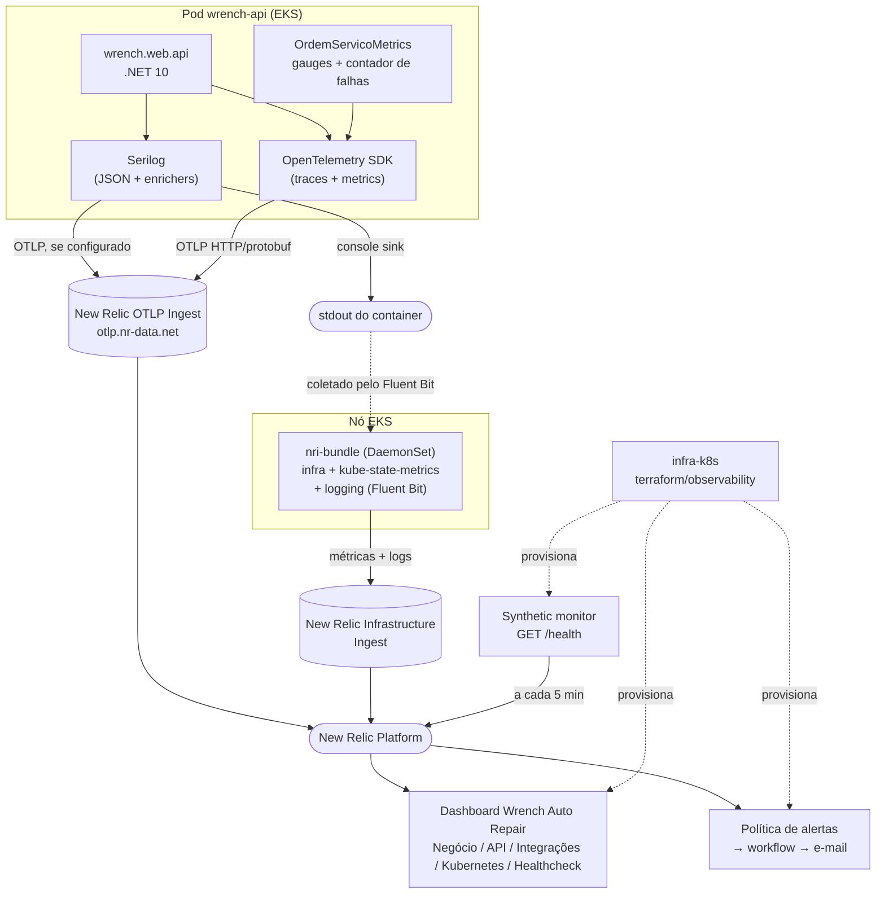

# ADR 003 - Observabilidade com New Relic

## Status

Aceito

## Contexto

A API da Wrench Auto Repair (`wrench.web.api`, .NET 10) processa o fluxo completo de Ordens de Serviço (diagnóstico, orçamento, execução, finalização) integrando múltiplos bounded contexts (autenticação, cadastro, estoque, ordem de serviço). Sem observabilidade, a aplicação não possui:

- Logs estruturados — apenas o logging padrão do host, sem formato JSON nem identificador de correlação entre requisições.
- Rastreamento distribuído (traces) entre camadas HTTP → aplicação → banco de dados.
- Métricas de negócio (ex: tempo médio por status de OS) ou técnicas (latência, erros, consumo de recursos).
- Alertas automáticos para falhas no processamento de OS.

Isso dificulta diagnosticar problemas em produção (rodando em Kubernetes/EKS) e acompanhar a saúde do negócio (volume de OS, gargalos por status).

## Decisão

Adotar **New Relic** (Free Tier) como plataforma de observabilidade, com a seguinte stack de instrumentação:

- **Logs estruturados**: Serilog, formato JSON (`Serilog.Formatting.Compact`), escritos no `stdout` do container — padrão para coleta em Kubernetes.
- **Traces e métricas**: OpenTelemetry SDK (`OpenTelemetry.Extensions.Hosting` + instrumentações de ASP.NET Core, HttpClient, EF Core e Runtime), exportados via **OTLP** diretamente para o endpoint OTLP do New Relic (`otlp.nr-data.net`), com métricas em temporalidade delta. O caminho padrão-aberto (OpenTelemetry) foi escolhido em vez do agente proprietário clássico (New Relic .NET Agent/profiler), evitando lock-in de instrumentação e mantendo a aplicação portável para outro backend compatível com OTLP.
- **Correlação log ↔ trace**: `Serilog.Enrichers.Span` injeta `TraceId`/`SpanId` em cada linha de log; o `CorrelationIdMiddleware` garante um `X-Correlation-ID` de negócio propagado entre requisições (indo além do trace técnico, cobrindo cenários de retry/integração externa).
- **Métricas de negócio customizadas** no meter `Wrench.OrdemServico`:
  - tempo médio por fase da Ordem de Serviço (diagnóstico, execução, entrega), calculado por agregação no banco e exposto via `ObservableGauge` (`OrdemServicoMetrics`);
  - contador `ordemservico.processamento.falhas`, incrementado pelo pipeline do MediatR `FalhaProcessamentoOrdemServicoBehavior` quando um comando do contexto de ordem de serviço lança exceção ou devolve erro inesperado. É o sinal do alerta de falha no processamento de OS.
- **Infraestrutura Kubernetes**: integração K8s do New Relic (`nri-bundle`) no cluster EKS, para métricas de nó/pod (CPU, memória, restarts), eventos do cluster e logs de outros containers — complementar às métricas de aplicação. Instalada pelo pipeline do repositório `infra-k8s` (pasta `newrelic-k8s`).
- **Dashboards, alertas e synthetics como código**: stack Terraform `terraform/observability` do repositório `infra-k8s`, com o provider `newrelic/newrelic`. Nada é configurado manualmente na UI.

## Arquitetura



**Fluxo resumido:**

1. A aplicação gera logs (Serilog), traces e métricas (OpenTelemetry) no próprio processo.
2. Logs vão para o `stdout` (sempre) e, se as variáveis `OTEL_EXPORTER_OTLP_*` estiverem configuradas, também direto via OTLP.
3. Traces e métricas do OpenTelemetry saem via OTLP (gRPC ou HTTP/protobuf, conforme `OTEL_EXPORTER_OTLP_PROTOCOL`).
4. O `nri-bundle`, implantado pelo pipeline do `infra-k8s` fora do ciclo de deploy da aplicação, coleta métricas de infraestrutura (CPU/memória de nós e pods) e lê o `stdout` de todos os containers do cluster via Fluent Bit.
5. O synthetic monitor chama `/health` de fora do cluster, cobrindo DNS, ALB e certificado.
6. Tudo converge para a mesma conta do New Relic, correlacionável por `trace.id`/`span.id` (logs ↔ traces) e por `clusterName`/`podName` (app ↔ infra). Dashboards e alertas consultam esses dados via NRQL.

### Por que dois exportadores separados (Serilog e OpenTelemetry SDK)?

`Serilog.Sinks.OpenTelemetry` (logs) e `OpenTelemetry.Exporter.OpenTelemetryProtocol` (traces/métricas) são pacotes distintos com comportamento distinto quanto ao endpoint HTTP — o do SDK oficial completa o path do sinal (`/v1/traces`, `/v1/metrics`) automaticamente a partir da variável de ambiente padrão; o do Serilog não, e exige o path completo (`/v1/logs`) explicitamente. Isso é tratado em [SerilogConfiguration.cs](../../wrench.auto.repair/src/wrench.web.api/Configuration/SerilogConfiguration.cs) (ver `BuildHttpLogsEndpoint`).

### Dashboards e alertas

O detalhamento de cada painel, das consultas NRQL e das condições de alerta está em
[dashboards-nrql.md](../observability/dashboards-nrql.md). Resumo:

| Requisito | Onde é atendido |
|---|---|
| Volume diário de ordens de serviço | Página **Negócio** |
| Tempo médio de execução por status (Diagnóstico, Execução, Finalização) | Página **Negócio**, gauges `ordemservico.*.duration` |
| Erros e falhas nas integrações | Página **Integrações** (HTTP de saída/SES, banco, logs de erro) |
| Latência das APIs | Página **API** e alerta de latência p95 |
| Consumo de CPU e memória do Kubernetes | Página **Kubernetes** |
| Healthchecks e uptime | Página **Healthcheck** (synthetic) e alertas de restart e de healthcheck |
| Alertas para falhas no processamento de OS | Condição **Falha no processamento de ordem de servico** |
| Logs JSON com correlação | Serilog + `CorrelationIdMiddleware` |

## Alternativas Consideradas

### New Relic vs. Datadog (comparação direta)

| Critério                                          | New Relic                                                                              | Datadog                                                                                                   |
| ------------------------------------------------- | -------------------------------------------------------------------------------------- | --------------------------------------------------------------------------------------------------------- |
| Camada gratuita                                   | Free tier **permanente**: 100GB/mês de ingestão, 1 usuário full, sem cartão de crédito | Trial de 14 dias; depois disso, cobrança por host + volume de log                                         |
| Custo em escala pequena (pós-tech, sem orçamento) | Viável indefinidamente dentro do limite gratuito                                       | Inviável além do trial                                                                                    |
| Suporte a OTLP nativo                             | Sim, ingestão OTLP de primeira classe (sem agente proprietário obrigatório)            | Sim, mas a experiência "completa" (APM, correlação) historicamente empurra pro Datadog Agent proprietário |
| Integração Kubernetes                             | `nri-bundle` (Helm chart oficial, gratuito no free tier)                               | Datadog Agent (Helm chart oficial), mas métricas de infra custam por host no plano pago                   |
| Dashboards/Alertas como código                    | Sim (provider Terraform oficial `newrelic/newrelic`)                                   | Sim (provider Terraform oficial `DataDog/datadog`) — equivalente nesse quesito                            |
| Maturidade/ecossistema geral                      | Muito madura                                                                           | Muito madura (uma das mais completas do mercado)                                                          |

**Conclusão:** as duas plataformas são tecnicamente equivalentes para o que este projeto precisa (logs, traces, métricas, dashboards, alertas, integração K8s via OTLP). O fator decisivo foi **custo**: o free tier do New Relic é permanente e cobre o volume esperado do projeto; o do Datadog é um trial que expiraria antes do fim do desafio, sem alternativa gratuita de longo prazo.

### Outras alternativas descartadas

- **Grafana Stack (Prometheus + Loki + Tempo + Grafana)** — 100% open-source e sem custo de licença, mas exige operar e manter a própria stack de observabilidade (storage, retenção, scraping) dentro do cluster. Overhead operacional alto para o escopo e tempo disponível do time.
- **Azure Application Insights / AWS CloudWatch + X-Ray** — Application Insights tem forte integração com .NET, mas a stack roda em AWS (EKS), tornando a integração menos natural. CloudWatch + X-Ray cobrem infra e traces, mas a experiência de dashboards de negócio e correlação log/trace é mais trabalhosa de montar, e também não é gratuita além de limites baixos.
- **Elastic Stack (ELK)** — muito forte para logs, porém exige Elasticsearch/Kibana operados à parte (custo de infra e operação), e APM/metrics exigiriam componentes adicionais (APM Server).
- **Dashboards e alertas criados manualmente na UI** — mais rápido de começar, mas não versionado, não revisado em pull request e perdido se a conta for recriada. Descartado em favor do Terraform.

## Consequências

### Positivas

- **Sem lock-in de agente proprietário**: por usar OpenTelemetry puro, é possível trocar o backend (ex: Grafana Tempo, Honeycomb) apenas mudando o endpoint/headers OTLP, sem tocar no código de instrumentação.
- **Sem alteração na imagem Docker**: a instrumentação OTLP roda inteiramente via pacotes NuGet + variáveis de ambiente (`OTEL_EXPORTER_OTLP_ENDPOINT`, `OTEL_EXPORTER_OTLP_HEADERS`), diferente do New Relic .NET Agent clássico, que exigiria copiar binários do profiler para dentro da imagem.
- **Correlação de ponta a ponta**: log, trace e CorrelationId de negócio conectados, facilitando troubleshooting de uma OS específica através de todas as camadas.
- **Observabilidade reproduzível**: dashboards, alertas e synthetics são recriados por `terraform apply`, e mudanças passam por pull request com `plan`.
- **Sem custo** dentro dos limites do free tier, adequado ao contexto do pós-tech.

### Negativas

- **Free tier tem limites** (retenção e volume de ingestão) — se o volume de logs/traces crescer, será necessário revisar amostragem (sampling) ou nível mínimo de log. O `nri-bundle` roda com `lowDataMode` pelo mesmo motivo.
- **Instrumentação de EF Core via OpenTelemetry ainda está em pré-release** (`OpenTelemetry.Instrumentation.EntityFrameworkCore`) — pode exigir ajuste quando a versão estável for lançada.
- **Dependência de configuração externa correta**: sem as variáveis de ambiente OTLP configuradas (Kubernetes Secret com a License Key), a aplicação não exporta dados (falha silenciosa) — importante validar explicitamente ao subir em cada ambiente.
- **Homologação e produção compartilham `service.name`**: os painéis agregam os dois namespaces. O atributo `deployment.environment` e `namespaceName` permitem separar quando necessário.
- **Duas credenciais distintas**: a License Key (ingestão, usada pela aplicação e pelo `nri-bundle`) e a User API Key (usada pelo Terraform para criar dashboards e alertas).

## Como rodar/validar localmente

1. `dotnet build wrench.auto.repair/wrench.auto.repair.sln` e `dotnet test` — os testes `CorrelationIdMiddlewareTests` e `FalhaProcessamentoOrdemServicoBehaviorTests` cobrem a correlação e o contador de falhas.
2. Sem variáveis de ambiente OTLP definidas: rodar a API normalmente (`dotnet run` no projeto `wrench.web.api`, com Postgres disponível) e conferir que os logs saem em JSON no console (formato `{"@t":..., "@m":..., ...}`).
3. Enviar uma requisição com e sem o header `X-Correlation-ID` e conferir que ele aparece na resposta e nos logs.
4. Para testar a exportação para o New Relic, definir (só na sessão do terminal, nunca em arquivo do repo):
   ```bash
   export OTEL_EXPORTER_OTLP_ENDPOINT="https://otlp.nr-data.net:4318"
   export OTEL_EXPORTER_OTLP_PROTOCOL="http/protobuf"
   export OTEL_EXPORTER_OTLP_HEADERS="api-key=<LICENSE_KEY_VALUE>"
   ```
   e rodar a API — logs, traces e métricas aparecem no New Relic em poucos segundos.

## Runbook de troubleshooting

| Sintoma                                                                               | Causa                                                                                                                                                                                                    | Solução                                                                                                                                                               |
| ------------------------------------------------------------------------------------- | -------------------------------------------------------------------------------------------------------------------------------------------------------------------------------------------------------- | --------------------------------------------------------------------------------------------------------------------------------------------------------------------- |
| `403 Forbidden` (corpo vazio) em qualquer endpoint de ingest do New Relic             | Uso do **Key ID** em vez do **Value** da API key. Na UI do New Relic, cada key tem um ID (identificador, ~64 caracteres) e um Value (o segredo de fato, formato `xxxxx...NRAL`) — são coisas diferentes. | Usar o campo **Value**, não o Key ID.                                                                                                                                 |
| Logs não chegam no New Relic via `Serilog.Sinks.OpenTelemetry`, mesmo com a key certa | Esse sink não completa o path do sinal (`/v1/logs`) a partir do endpoint base — diferente do SDK oficial do OpenTelemetry usado para traces/métricas.                                                    | Tratado por `BuildHttpLogsEndpoint` em [SerilogConfiguration.cs](../../wrench.auto.repair/src/wrench.web.api/Configuration/SerilogConfiguration.cs).                 |
| Falhas de exportação do Serilog não aparecem em lugar nenhum                          | Por padrão, o Serilog descarta silenciosamente erros internos dos sinks.                                                                                                                                 | `Serilog.Debugging.SelfLog.Enable(...)` está habilitado em `ConfigureSerilog()` — acompanhar o stderr.                                                                |
| `terraform apply` do stack `observability` falha com `401`/`403`                      | Credencial errada: o provider exige a **User API Key** (`NRAK-...`), não a License Key de ingestão.                                                                                                     | Conferir o secret `NEW_RELIC_API_KEY` do repositório `infra-k8s`.                                                                                                     |
| Widget do dashboard preso em "No chart data available" / "No Value"                   | Não há eventos para o tipo de dado consultado (`Span`, `K8sPodSample`, etc.) — geralmente falta de tráfego ou agente não instalado, não query errada.                                                   | Confirmar com `SELECT keyset() FROM <EventType> SINCE 1 hour ago` se existe algum evento.                                                                             |
| Opção de visualização "Table" não aparece num widget                                  | A query tem `TIMESERIES` — isso restringe a visualização a gráficos ao longo do tempo (Line/Area/Bar).                                                                                                   | Remover `TIMESERIES` da query se o objetivo é uma tabela/snapshot.                                                                                                    |
| Percentual (`percentage()`) mostrando "No Value" em vez de 0%                         | Divisão por zero eventos é indefinida, não igual a zero — forçar 0% seria enganoso.                                                                                                                      | Aguardar eventos reais; não forçar um valor.                                                                                                                          |

## Notas Adicionais

- A License Key do New Relic **nunca** é commitada. A aplicação a lê via `OTEL_EXPORTER_OTLP_HEADERS`, provida por Kubernetes Secret (secret `NEW_RELIC_LICENSE_KEY` do pipeline do `app-k8s`); o `nri-bundle` a recebe por `--set global.licenseKey` (secret de mesmo nome no `infra-k8s`).
- Detalhes de implementação estão na documentação XML de `CorrelationIdMiddleware`, `SerilogConfiguration`, `ObservabilityConfiguration`, `OrdemServicoMetrics` e `FalhaProcessamentoOrdemServicoBehavior`.
- Dashboards, alertas e consultas NRQL: [dashboards-nrql.md](../observability/dashboards-nrql.md).
- Agente de infraestrutura: repositório `infra-k8s`, pasta `newrelic-k8s` (values e instruções).
- Stack Terraform de dashboards, alertas e synthetics: repositório `infra-k8s`, pasta `terraform/observability`.
