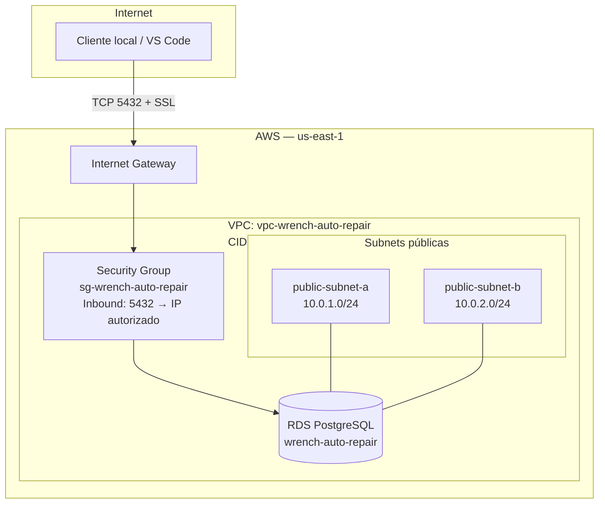

# Configuração do Banco de Dados — AWS RDS (PostgreSQL)

Documentação da infraestrutura de banco de dados do projeto **Wrench Auto Repair**, hospedada na AWS.

## Visão geral

| Item | Valor |
|------|-------|
| **Engine** | PostgreSQL (Amazon RDS) |
| **Região** | `us-east-1` |
| **Identificador da instância** | `wrench-auto-repair` |
| **Endpoint** | `wrench-auto-repair.cha2ioqcihsl.us-east-1.rds.amazonaws.com` |
| **Porta** | `5432` |
| **Database inicial** | `postgres` |
| **Usuário master** | `postgres` |
| **Acesso público** | Sim (`Publicly accessible = Yes`) |
| **SSL** | **Obrigatório** para conexões externas |

---

## Arquitetura de rede

A infraestrutura foi criada com o **VPC Wizard** da AWS (opção *VPC and more*), voltada para ambiente de desenvolvimento com acesso local ao banco.



### Recursos criados

| Recurso | Nome | Descrição |
|---------|------|-----------|
| **VPC** | `vpc-wrench-auto-repair` | Rede isolada com CIDR `10.0.0.0/16` |
| **Subnets públicas** | 2 subnets em AZs distintas | `10.0.1.0/24` e `10.0.2.0/24` |
| **Internet Gateway** | Criado automaticamente pelo wizard | Permite tráfego de/para a internet |
| **Route table** | Pública | Rota `0.0.0.0/0` → Internet Gateway |
| **Security Group** | `sg-wrench-auto-repair` | Controla acesso à porta 5432 |
| **DB Subnet Group** | `wrench-auto-repair-db-subnet` | Agrupa as 2 subnets públicas para o RDS |
| **RDS** | `wrench-auto-repair` | Instância PostgreSQL |

### Configurações de DNS na VPC

- **DNS hostnames:** habilitado
- **DNS resolution:** habilitado

---

## Security Group (`sg-wrench-auto-repair`)

Regra de entrada (inbound):

| Tipo | Protocolo | Porta | Origem | Descrição |
|------|-----------|-------|--------|-----------|
| PostgreSQL | TCP | 5432 | `SEU_IP_PUBLICO/32` | Acesso local para desenvolvimento |

Regra de saída (outbound): padrão (todo tráfego permitido).

### Atualizar IP autorizado

Se o IP público mudar (troca de rede, reinício do roteador, 4G), atualize a regra no console:

1. Descubra seu IP atual:
   ```powershell
   (Invoke-WebRequest -Uri "https://checkip.amazonaws.com" -UseBasicParsing).Content.Trim()
   ```
2. **EC2** → **Security Groups** → `sg-wrench-auto-repair`
3. **Edit inbound rules** → altere o CIDR para `NOVO_IP/32`

> **Nunca** use `0.0.0.0/0` em produção — isso expõe o banco para toda a internet.

---

## DB Subnet Group (`wrench-auto-repair-db-subnet`)

| Campo | Valor |
|-------|-------|
| **VPC** | `vpc-wrench-auto-repair` |
| **Subnets** | As 2 subnets **públicas** da VPC |
| **AZs** | Somente as AZs onde essas subnets existem |

Ao criar o subnet group, a AWS lista todas as AZs da região. Selecione **apenas** as 2 AZs que possuem subnets na VPC `vpc-wrench-auto-repair`.

---

## Conexão local

### Pré-requisitos

1. RDS com status **Available**
2. **Publicly accessible** = **Yes**
3. Security Group com seu IP em `/32`
4. Conexão com **SSL habilitado**

### Testar conectividade de rede

```powershell
Test-NetConnection -ComputerName wrench-auto-repair.cha2ioqcihsl.us-east-1.rds.amazonaws.com -Port 5432
```

Resultado esperado: `TcpTestSucceeded : True`

### Conexão via `psql`

```bash
psql "host=wrench-auto-repair.cha2ioqcihsl.us-east-1.rds.amazonaws.com port=5432 dbname=postgres user=postgres sslmode=require"
```

### Conexão via VS Code

Habilite SSL na extensão de banco de dados:

| Extensão | Configuração |
|----------|--------------|
| **SQLTools** | `ssl: true` ou `sslmode: require` |
| **Database Client** | SSL Mode: `require` |
| **Connection string** | `?sslmode=require` no final da URL |

**Erro comum sem SSL:**

```
FATAL: no pg_hba.conf entry for host "...", user "postgres", database "postgres", no encryption
```

Esse erro indica que a rede está OK, mas a conexão foi recusada por falta de criptografia. Ative SSL.

---

## Variáveis de ambiente (exemplo)

Crie um arquivo `.env` na raiz do projeto (não commite no Git):

```env
DATABASE_HOST=wrench-auto-repair.cha2ioqcihsl.us-east-1.rds.amazonaws.com
DATABASE_PORT=5432
DATABASE_NAME=postgres
DATABASE_USER=postgres
DATABASE_PASSWORD=<sua-senha>
DATABASE_SSL=true
```

### Connection string

```
postgresql://postgres:<senha>@wrench-auto-repair.cha2ioqcihsl.us-east-1.rds.amazonaws.com:5432/postgres?sslmode=require
```

## Troubleshooting

| Sintoma | Causa provável | Solução |
|---------|----------------|---------|
| Timeout (15s) | Security Group ou IP incorreto | Atualize inbound rule com IP atual `/32` |
| Timeout (15s) | Public access desabilitado | RDS → Modify → Public access = Yes |
| `no encryption` | SSL desabilitado no cliente | Ative `sslmode=require` |
| `password authentication failed` | Credenciais incorretas | Verifique usuário/senha do master |
| Conectava ontem, hoje não | IP público mudou | Atualize Security Group |

---

## Referências

- [Amazon RDS — PostgreSQL](https://docs.aws.amazon.com/AmazonRDS/latest/UserGuide/CHAP_PostgreSQL.html)
- [Conectar ao RDS a partir de fora da AWS](https://docs.aws.amazon.com/AmazonRDS/latest/UserGuide/USER_ConnectToInstance.html)
- [SSL no RDS PostgreSQL](https://docs.aws.amazon.com/AmazonRDS/latest/UserGuide/PostgreSQL.Concepts.General.SSL.html)
- [VPC Wizard](https://docs.aws.amazon.com/vpc/latest/userguide/working-with-vpcs.html)
