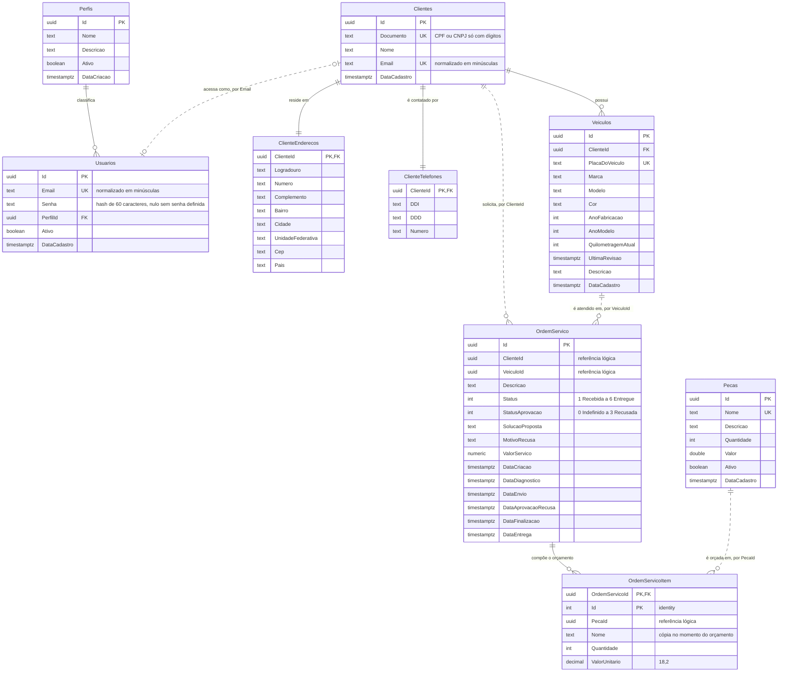

# Modelo relacional — Wrench Auto Repair

Justificativa formal da escolha do banco de dados, diagrama entidade-relacionamento de todos os
bounded contexts, explicação de cada relacionamento e dos ajustes de consistência, performance e
segurança do modelo.

## Justificativa da escolha

O banco é **PostgreSQL 18 no Amazon RDS**. A comparação completa com MySQL, SQL Server, Aurora e
DynamoDB está no [RFC 003](../rfcs/RFC%20003%20-%20Escolha%20do%20Banco%20de%20Dados.md); as
decisões de motor e de hospedagem estão nos ADRs [001](../adrs/ADR%20001%20-%20Escolha%20do%20Banco%20de%20Dados.md)
e [002](../adrs/ADR%20002%20-%20Escolha%20do%20Banco%20de%20Dados.md). O que torna o modelo
relacional a escolha certa para este domínio:

| Característica do domínio | O que exige do banco | Como o PostgreSQL atende |
|---|---|---|
| Abrir OS, registrar diagnóstico com peças e aprovar orçamento são operações atômicas | transação ACID entre tabelas | transação por `UnitOfWork.CommitAsync()` sobre o `DbContext` |
| CPF/CNPJ, e-mail, placa e nome de peça não podem se repetir | unicidade garantida pelo banco, não pela aplicação | índices `UNIQUE` |
| Veículo pertence a cliente; item pertence à OS; usuário tem perfil | integridade referencial | chaves estrangeiras com `NOT NULL` |
| Listagens por status e cliente, tempo médio por fase, volume diário | filtro, ordenação e agregação no servidor | SQL com `AVG` e função `datediff_milliseconds` |
| Dois consumidores com necessidades diferentes (API e Lambda) | privilégios distintos por consumidor | roles e `GRANT` por coluna |
| Schema evolui junto com o código | migrations versionadas | EF Core Migrations com Npgsql |

O RDS acrescenta backup automático de 7 dias, patch gerenciado e provisionamento por Terraform no
repositório `infra-db`.

## Organização física

* **Dois databases na mesma instância RDS**, com o mesmo schema: `wrench_auto_repair` (produção) e
  `wrench_auto_repair_hml` (homologação). Cada ambiente da API e da Lambda conecta apenas ao seu, e
  as migrations são aplicadas em cada um pelo deploy do respectivo ambiente.
* **Um schema** (`public`) por database para os quatro bounded contexts.
* **Quatro `DbContext`**, um por contexto, cada um com migrations próprias no seu projeto `infra`:
  `AutenticacaoContext`, `CadastroContext`, `PecaDbContext` e `OrdemServicoDbContext`.
* O histórico das migrations dos quatro contextos fica na mesma tabela `__EFMigrationsHistory`. Os
  identificadores são prefixados por timestamp, então não colidem.
* A API aplica as migrations na subida, nesta ordem: autenticação, ordem de serviço, cadastro e
  estoque. Como não há chave estrangeira entre contextos, a ordem não afeta a criação das tabelas.
* Value objects do domínio (`CpfCnpj`, `Email`, `NomeRazaoSocial`) são *owned types* e viram
  colunas da própria tabela; `Endereco`, `Telefone` e os itens da OS viram tabelas dependentes.

## Diagrama ER

Linhas contínuas são chaves estrangeiras no banco. Linhas tracejadas são relacionamentos lógicos
entre bounded contexts, resolvidos pela aplicação, sem constraint.

## Relacionamentos

### Chaves estrangeiras (dentro do mesmo bounded contexto)

| Relacionamento | Cardinalidade | Contexto | Explicação |
|---|---|---|---|
| `Perfis` → `Usuarios` | 1 : N | autenticação | Todo usuário tem exatamente um perfil (`Admin`, `Funcionario` ou `Cliente`), obrigatório por `PerfilId NOT NULL`. Um perfil agrupa vários usuários. Os três perfis são dados de referência semeados pela migration com identificadores fixos, o que permite referenciá-los em código e em testes. O `Nome` do perfil é a claim `Role` do JWT. |
| `Clientes` → `ClienteEnderecos` | 1 : 1 | cadastro | O endereço é um value object sem identidade própria. A PK da tabela dependente é a própria FK `ClienteId`, o que impede mais de um endereço por cliente e faz o endereço existir apenas enquanto o cliente existir. |
| `Clientes` → `ClienteTelefones` | 1 : 1 | cadastro | Mesmo desenho do endereço: value object persistido em tabela própria com PK igual à FK. Separar em tabela mantém a tabela `Clientes` estreita para as consultas por documento e e-mail. |
| `Clientes` → `Veiculos` | 1 : N | cadastro | Um cliente possui vários veículos; cada veículo pertence a um único cliente (`ClienteId NOT NULL`). A placa é única no sistema inteiro, não por cliente, porque identifica o veículo fisicamente. |
| `OrdemServico` → `OrdemServicoItem` | 1 : N | ordem de serviço | Os itens são as peças do orçamento. A PK composta `(OrdemServicoId, Id)` torna o item dependente da OS: não existe item fora de uma ordem, e a exclusão da ordem remove os itens. |

### Relacionamentos lógicos (entre bounded contexts)

| Relacionamento | Cardinalidade | Como é garantido | Por que não é FK |
|---|---|---|---|
| `Clientes` ↔ `Usuarios` por `Email` | 1 : 0..1 | Ao cadastrar um cliente, o evento `ClienteCadastradoEvent` cria o usuário com o mesmo e-mail, perfil `Cliente`, ativo e sem senha. Os dois e-mails são normalizados (sem acentos, sem espaços, minúsculas) e únicos em cada tabela. | Cadastro e autenticação têm `DbContext` e migrations separados. Um usuário funcionário não tem cliente, e o cliente pode existir antes do usuário. É por essa junção que a Lambda chega do CPF ao perfil. |
| `Clientes` → `OrdemServico` por `ClienteId` | 1 : N | Na abertura, a consulta integrada `VeiculoExisteEPertenceAoClienteQuery` confirma no contexto de cadastro que cliente e veículo existem e estão vinculados. | Uma FK entre contextos acoplaria a ordem das migrations e impediria extrair um contexto para outro banco. A validação acontece no momento da escrita, que é quando a regra de negócio importa. |
| `Veiculos` → `OrdemServico` por `VeiculoId` | 1 : N | Mesma consulta integrada da linha anterior. | Mesmo motivo. |
| `Pecas` → `OrdemServicoItem` por `PecaId` | 1 : N | No diagnóstico, o contexto de ordem de serviço consulta o estoque (`ObterPecasPorIdsCommand`, `PecaExisteQuery`) e grava no item o `Nome` e o `ValorUnitario` vigentes. | O item registra o orçamento apresentado ao cliente. Copiar nome e valor preserva o orçamento mesmo que a peça seja renomeada, reajustada ou inativada depois — desnormalização intencional. |

## Ciclo de vida da ordem no modelo

O status é um inteiro que espelha `OrdemServicoStatus`, e cada transição relevante grava um
timestamp. São esses campos que alimentam as métricas de tempo por fase:

| Status | Valor | Timestamp gravado | Fase medida |
|---|---|---|---|
| Recebida | 1 | `DataCriacao` | — |
| Em diagnóstico | 2 | — | — |
| Aguardando aprovação | 3 | `DataDiagnostico`, `DataEnvio` | **Diagnóstico**: `DataCriacao` → `DataDiagnostico` |
| Em execução | 4 | `DataAprovacaoRecusa`, `StatusAprovacao` | — |
| Finalizada | 5 | `DataFinalizacao` | **Execução**: `DataAprovacaoRecusa` → `DataFinalizacao` |
| Entregue | 6 | `DataEntrega` | **Finalização**: `DataFinalizacao` → `DataEntrega` |

Uma recusa grava `DataAprovacaoRecusa`, `StatusAprovacao = 3` e `MotivoRecusa`, e não produz
`DataFinalizacao` — por isso as médias de execução consideram apenas ordens aprovadas sem precisar
filtrar pelo status de aprovação.

## Ajustes de consistência e performance

### Unicidade e normalização

| Índice | Tabela | Garante |
|---|---|---|
| `IX_Clientes_Documento` (único) | `Clientes` | Um cadastro por CPF/CNPJ. O value object grava só dígitos, então `529.982.247-25` e `52998224725` colidem. |
| `IX_Clientes_Email` (único) | `Clientes` | Um cliente por e-mail, que é a chave da junção com `Usuarios`. |
| `IX_Usuarios_Email` (único) | `Usuarios` | Um login por e-mail. |
| `IX_Veiculos_PlacaDoVeiculo` (único) | `Veiculos` | Uma placa no sistema. |
| `IX_Pecas_Nome` (único) | `Pecas` | Um item de estoque por nome. |

### Índices de acesso

| Índice | Consulta atendida |
|---|---|
| `IX_Usuarios_PerfilId` | Junção usuário → perfil na autenticação e na listagem de usuários. |
| `IX_Veiculos_ClienteId` | Veículos de um cliente e a consulta integrada de posse na abertura de OS. |
| `IX_Clientes_Documento` + `IX_Usuarios_Email` + PK de `Perfis` | Consulta da Lambda: CPF → e-mail → usuário → perfil, três buscas por índice único. |
| PK `(OrdemServicoId, Id)` | Carga dos itens da OS junto com a ordem. |
| `IX_OrdemServico_ClienteId` | Ordens de serviço de um cliente (`GET /api/v1/ordem-servico/cliente`). |
| `IX_OrdemServico_Status_DataCriacao` | Monitoramento das ordens em andamento, filtradas por status e ordenadas por data de criação. |

Os dois índices de `OrdemServico` são criados pela migration `IndicesConsultaOrdemServico` do
`OrdemServicoDbContext`.

### Agregações no banco

A função `datediff_milliseconds(timestamptz, timestamptz)` é criada pela API na subida e declarada
como `IMMUTABLE`. As médias de tempo por fase são calculadas com `AVG` no PostgreSQL, sem trazer as
ordens para a memória da aplicação; o resultado é publicado a cada 5 minutos como métrica
`ordemservico.*.duration`.

### Segregação de privilégios

| Role | Usado por | Privilégios |
|---|---|---|
| master do RDS | Terraform (`infra-db/terraform/roles`) | criar roles e conceder privilégios |
| role da aplicação | API no EKS | `CONNECT` e `CREATE` no banco, `USAGE` e `CREATE` no schema, CRUD nas tabelas e sequências; dono das tabelas criadas pelas migrations |
| role da Lambda | Lambda de autenticação | `CONNECT`, `USAGE` no schema e `SELECT` apenas em `Clientes(Id, Documento, Email)`, `Usuarios(Id, Email, PerfilId, Ativo)` e `Perfis(Id, Nome)` |

Os privilégios dos dois roles são concedidos igualmente nos databases `wrench_auto_repair` e
`wrench_auto_repair_hml`.

A Lambda não enxerga senha, telefone, endereço, nome do cliente, veículos, estoque nem ordens de
serviço. O conjunto de colunas é o contrato entre a Lambda e o schema da API, verificado por teste
de contrato no pipeline do `app-k8s`. Concessão por coluna só é aceita em tabela existente, então o
`roles` é aplicado para a Lambda depois do primeiro deploy da API.

## Restrições conhecidas do modelo

* **Tipos monetários heterogêneos.** `Pecas.Valor` é `double precision`, `OrdemServico.ValorServico`
  é `numeric` sem precisão definida e `OrdemServicoItem.ValorUnitario` é `decimal(18,2)`.
* **Textos sem limite de tamanho.** Colunas `text` sem `CHECK` de comprimento; os limites estão só
  nas validações da aplicação.
* **Versão local diferente da produção.** Os `docker-compose` de desenvolvimento e teste usam
  PostgreSQL 16, e a produção usa 18.

## Documentos relacionados

* [RFC 003 — Escolha do Banco de Dados](../rfcs/RFC%20003%20-%20Escolha%20do%20Banco%20de%20Dados.md)
* [Migrations do Entity Framework Core](./migrations.md)
* [Configuração do RDS](./AWS%20-%20Postgres%20setup.md)
* [ADR 005 — Padrão de Comunicação](../adrs/ADR%20005%20-%20Padrao%20de%20Comunicacao.md)
* [Diagrama de sequência — abertura de ordem de serviço](../diagramas/sequencia-abertura-ordem-servico.md)
