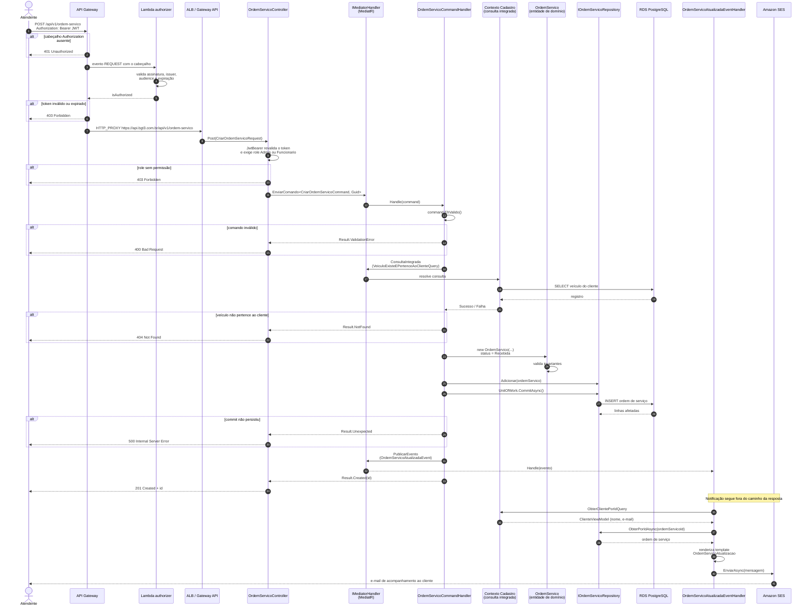
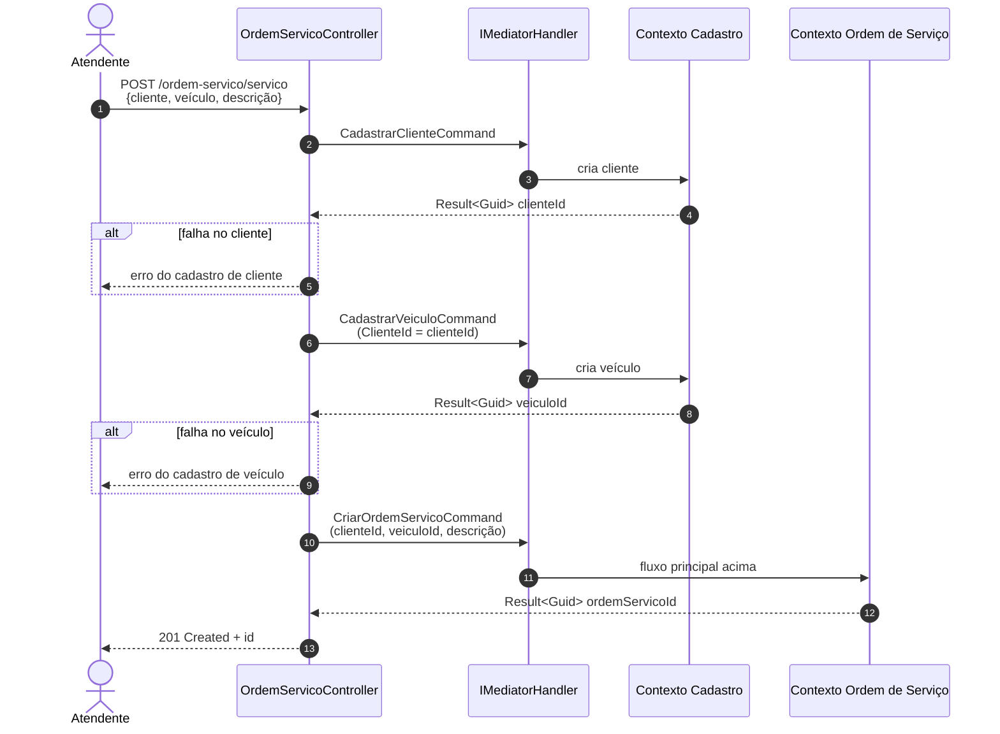
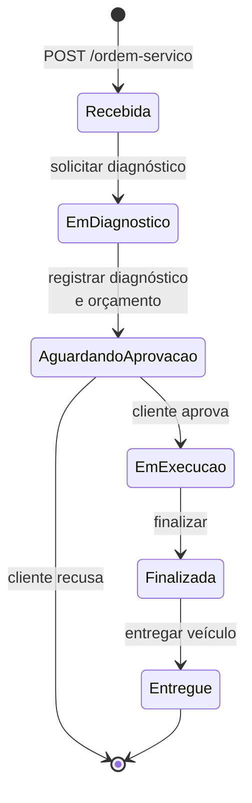

# Diagrama de sequência — Abertura de ordem de serviço

Fluxo de `POST /api/v1/ordem-servico`, da borda autenticada até a notificação por e-mail.

O endpoint existe em duas variantes:

- **`POST /api/v1/ordem-servico`** — cliente e veículo já cadastrados; recebe os identificadores.
- **`POST /api/v1/ordem-servico/servico`** — atendimento de balcão: cadastra cliente e veículo na
  mesma requisição e então abre a ordem.

O diagrama principal cobre a primeira; a segunda está logo abaixo. O token usado aqui é obtido no
[fluxo de autenticação](./sequencia-autenticacao.md).

## Fluxo principal

## Pontos de atenção do fluxo

**A autorização acontece em duas camadas.** O authorizer do API Gateway recusa na borda qualquer
token inválido, antes de a requisição chegar ao cluster. A aplicação revalida o mesmo token e aplica
a role exigida pelo endpoint; é essa segunda camada que decide entre `Admin`, `Funcionario` e
`Cliente`, e que protege a API de quem alcança o ALB sem passar pelo gateway.

**A validação acontece em três níveis.** O `EhValido()` do comando roda as regras de
FluentValidation sobre o formato da entrada; a consulta integrada confirma que o veículo existe e
pertence àquele cliente; e o construtor da entidade `OrdemServico` valida as invariantes de
domínio. Cada nível devolve um `TipoErroEnum` diferente, que o `ResultExtensions` traduz para o
status HTTP correspondente.

**A checagem de veículo cruza bounded contexts sem acoplar código.** O contexto de ordem de
serviço não referencia o repositório de cadastro: ele publica uma *integrated query* no mediator
(`VeiculoExisteEPertenceAoClienteQuery`) e quem responde é o contexto de cadastro. A dependência é
com a mensagem, não com a implementação.

**O e-mail não bloqueia a resposta.** A notificação é disparada por evento
(`OrdemServicoAtualizadaEvent`) e o handler engole exceções do envio: uma indisponibilidade do SES
não pode transformar uma ordem de serviço já persistida em erro para o atendente. O efeito
colateral é que uma falha de envio não aparece para o atendente: ela é visível apenas na telemetria,
no painel de erros de integração do New Relic, que lê as chamadas HTTP de saída com erro.

**O commit é explícito.** O repositório não salva sozinho; `UnitOfWork.CommitAsync()` delimita a
transação, e o handler decide o resultado a partir do número de linhas afetadas.

## Variante de balcão

`POST /api/v1/ordem-servico/servico` resolve cliente e veículo antes de abrir a ordem, abortando no
primeiro erro:

A requisição passa pela mesma borda do fluxo principal (API Gateway, authorizer e ALB), omitida
abaixo.

Os três comandos rodam em transações separadas, uma por contexto. Um erro no terceiro passo deixa
cliente e veículo já cadastrados — comportamento aceitável no domínio, já que ambos são cadastros
legítimos e reaproveitáveis na próxima tentativa.

## Ciclo de vida da ordem

A abertura cria a ordem no status `Recebida`. As transições seguintes têm endpoints próprios e
cada mudança de status republica o `OrdemServicoAtualizadaEvent`, gerando nova notificação:

## Documentos relacionados

- [Diagrama de componentes](../infraestrutura/arquitetura.md)
- [Pipeline HTTP e healthchecks](../infraestrutura/pipeline-http.md)
- [Linguagem ubíqua](../linguagem-ubiqua/linguage-ubiqua.md)
- [Diagrama de sequência — autenticação](./sequencia-autenticacao.md)
- [ADR 005 — Padrão de comunicação](../adrs/ADR%20005%20-%20Padrao%20de%20Comunicacao.md)
- [Dashboards e alertas](../observability/dashboards-nrql.md)
