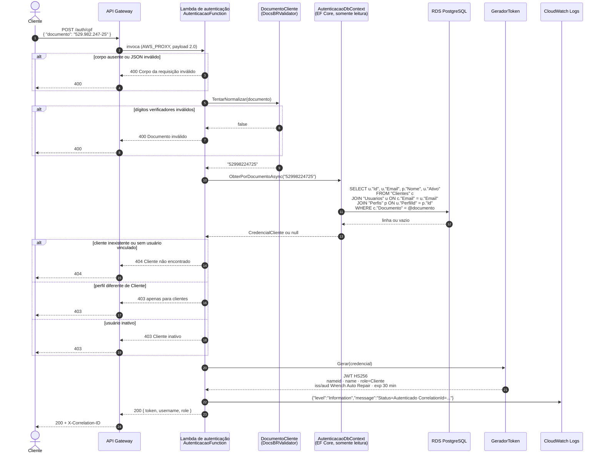
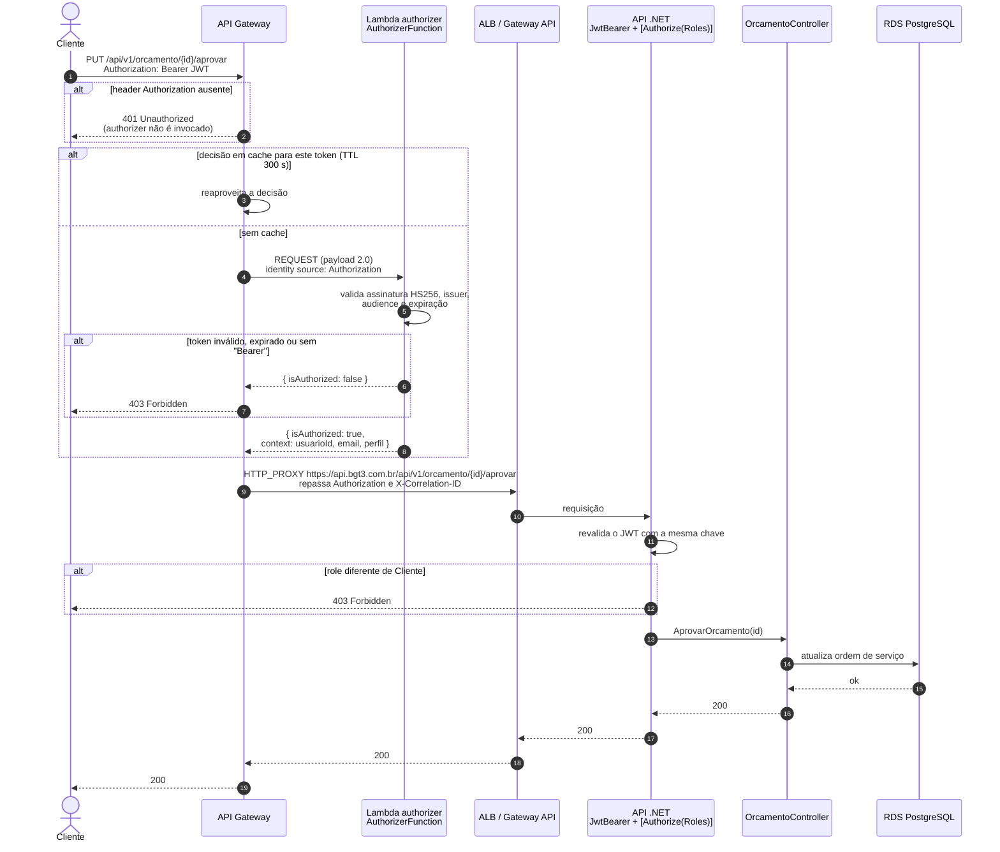

# Diagrama de sequência — Autenticação por CPF e consumo de rota protegida

Dois fluxos encadeados: o cliente troca o CPF por um JWT na Lambda de autenticação e depois usa esse
token nas rotas protegidas, que passam pelo Lambda authorizer antes de chegar à API no EKS.

Componentes, por repositório:

| Componente | Repositório | Recurso |
|---|---|---|
| API Gateway HTTP | `lambda-auth` | `wrench-api-gateway-<env>` |
| Lambda de autenticação | `lambda-auth` | `wrench-auth-cpf-<env>` |
| Lambda authorizer | `lambda-auth` | `wrench-auth-authorizer-<env>` |
| RDS PostgreSQL | `infra-db` | role `wrench_lambda_auth`, `SELECT` por coluna |
| ALB e API .NET | `app-k8s` / `infra-k8s` | `api.bgt3.com.br`, `hml-api.bgt3.com.br` |

## 1. Autenticação por CPF

O documento não é registrado em log. Uma exceção inesperada (banco indisponível, por exemplo) gera
`500` com mensagem genérica, e o detalhe fica apenas no log da function.

## 2. Consumo de rota protegida

Exemplo: o cliente aprova o orçamento da sua ordem de serviço, endpoint que exige a role `Cliente`.

## Pontos de atenção

- **Duas validações do mesmo token.** O authorizer recusa na borda, sem consumir a aplicação; a API
  revalida e aplica as roles. A segunda validação cobre o acesso direto ao ALB e a janela de cache
  do authorizer, em que um token recém-expirado ainda passa pela borda.
- **Contrato do token.** Chave, issuer e audience são idênticos na Lambda, no authorizer e na API; a
  chave vem do secret `JWT_SIGNING_KEY` nos repositórios `lambda-auth` e `app-k8s`.
- **Rotas públicas.** `POST /auth/cpf`, `POST /api/v1/autenticacao`, `PUT /api/v1/usuario/primeiro-acesso`,
  `GET /api/v1/ordem-servico/{id}`, healthchecks e documentação não passam pelo authorizer, espelhando
  os endpoints `[AllowAnonymous]` da API.

## Referências

- [RFC 002 — Estratégia de autenticação](../rfcs/RFC%20002%20-%20Estrategia%20de%20Autenticacao.md)
- [ADR 006 — Lambda Authorizer no API Gateway](../adrs/ADR%20006%20-%20Lambda%20Authorizer.md)
- [Diagrama de sequência — abertura de ordem de serviço](./sequencia-abertura-ordem-servico.md)
- Repositório `lambda-auth`: README e `docs/openapi.yaml`
