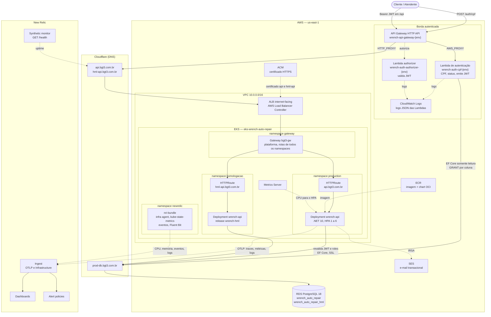
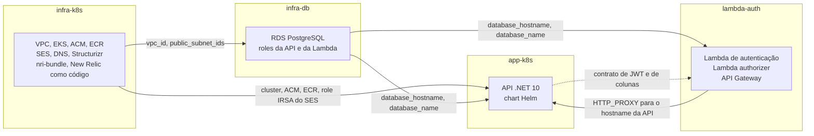
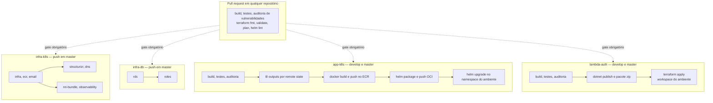

# Arquitetura — Wrench Auto Repair

Visão de nuvem da solução: borda autenticada com API Gateway e funções serverless, aplicação em
Kubernetes (EKS), banco gerenciado (RDS PostgreSQL) e observabilidade no New Relic. Todo recurso é
provisionado com Terraform, com estado no HCP Terraform, e entregue por quatro repositórios com
CI/CD próprio no GitHub Actions.

## Diagrama de componentes

Linhas sólidas representam o caminho da requisição e dos dados; linhas pontilhadas representam
relações de controle, telemetria e provisionamento. `{env}` é `homologacao` ou `production`.

## Borda autenticada

O API Gateway é o ponto de entrada documentado para consumidores. Cada ambiente tem o seu gateway,
e o destino do `HTTP_PROXY` é o hostname da API naquele ambiente.

| Rota | Integração | Authorizer | Destino |
|---|---|---|---|
| `POST /auth/cpf` | `AWS_PROXY` | não | Lambda de autenticação |
| `ANY /api/{proxy+}` | `HTTP_PROXY` | Lambda authorizer | `https://api.bgt3.com.br/api/{proxy}` |
| Login por e-mail e senha da API | `HTTP_PROXY` | não | endpoint de autenticação da API |
| `GET /health` | `HTTP_PROXY` | não | liveness da API |
| Documentação Scalar e OpenAPI | `HTTP_PROXY` | não | `/docs-ui` e `/openapi` da API |

**Lambda de autenticação.** Recebe o CPF, valida os dígitos verificadores, consulta o cliente, o
usuário vinculado e o perfil, recusa usuário inativo e emite um JWT HS256.

**Lambda authorizer.** Recebe o cabeçalho `Authorization`, valida assinatura, emissor, audiência e
expiração, e devolve a decisão ao gateway. O JWT authorizer nativo do API Gateway HTTP exige chaves
publicadas por JWKS e não aceita HS256, por isso a validação é feita por função
([ADR 006](../adrs/ADR%20006%20-%20Lambda%20Authorizer.md)).

**Defesa em profundidade.** O ALB continua alcançável pela internet. A API revalida o token e as
roles de cada endpoint, então uma requisição que não passe pelo gateway recebe a mesma recusa.

## Contratos entre componentes

| Contrato | Entre | Definição | Garantia |
|---|---|---|---|
| Token JWT | Lambda de autenticação, authorizer e API | `Issuer` e `Audience` `Wrench Auto Repair`, chave `JWT_SIGNING_KEY`, claims `NameIdentifier`, `Name` e `Role` | mesmos valores injetados por secret nos dois repositórios |
| Colunas lidas pela Lambda | Lambda de autenticação e schema da API | `Clientes(Id, Documento, Email)`, `Usuarios(Id, Email, PerfilId, Ativo)`, `Perfis(Id, Nome)` | teste de contrato no `app-k8s` e `GRANT SELECT` por coluna no `infra-db` |
| Outputs de infraestrutura | repositórios de infraestrutura e consumidores | `vpc_id`, `public_subnet_ids`, `cluster_name`, `database_hostname`, `database_name`, repositórios ECR | remote state do HCP Terraform |

O modelo de dados completo e os privilégios de cada role estão em
[Modelo relacional](../database/modelo-relacional.md).

## Observabilidade

| Sinal | Origem | Destino | Uso |
|---|---|---|---|
| Traces HTTP, EF Core e HttpClient | OpenTelemetry na API | New Relic via OTLP | latência por rota, erros de integração |
| Métricas de runtime e de negócio | OpenTelemetry na API (`ordemservico.*.duration`, `ordemservico.processamento.falhas`) | New Relic via OTLP | tempo médio por fase, alertas de falha de OS |
| Logs JSON com `CorrelationId`, `TraceId` e `SpanId` | Serilog na API | stdout e New Relic via OTLP | investigação correlacionada |
| CPU, memória, eventos e logs do cluster | `nri-bundle` | New Relic Infrastructure | consumo de recursos e restarts |
| Uptime | Synthetic monitor em `/health` | New Relic | disponibilidade vista de fora do cluster |
| Logs das Lambdas | runtime Lambda em formato JSON | CloudWatch Logs | autenticação e autorização |

Dashboards, alert policies e o synthetic monitor são declarados em Terraform no repositório
`infra-k8s` (`terraform/observability`). As queries estão descritas em
[dashboards NRQL](../observability/dashboards-nrql.md) e a decisão de ferramenta no
[ADR 003](../adrs/ADR%20003%20-%20Observabilidade%20com%20New%20Relic.md).

## Repositórios e fronteiras

Os valores atravessam repositórios por **remote state do HCP Terraform**. Nenhum pipeline dispara
outro; cada consumidor lê o estado atual da infraestrutura no momento do próprio deploy.

## Fluxo de deploy (CI/CD)

| Repositório | `develop` | `master` |
|---|---|---|
| `app-k8s` | namespace `homologacao`, `hml-api.bgt3.com.br`, database `wrench_auto_repair_hml` | namespace `production`, `api.bgt3.com.br`, database `wrench_auto_repair` |
| `lambda-auth` | Lambdas e gateway de homologação | Lambdas e gateway de produção |
| `infra-k8s`, `infra-db` | PR roda `plan` | `apply` da infraestrutura compartilhada |

Homologação e produção compartilham cluster, Gateway de plataforma, ALB e instância RDS. A
segregação é por namespace, release Helm, hostname, database e API Gateway
([ADR 004](../adrs/ADR%20004%20-%20Uso%20de%20HPA.md)).

### Ordem do primeiro provisionamento

O **Orquestrador de Provisionamento** do `infra-k8s` executa a sequência a partir de um único
*Run workflow*, disparando o pipeline de cada repositório e aguardando o anterior terminar:

1. `infra-k8s`: rede, cluster, ECR, e-mail, Gateway de plataforma, DNS e observabilidade.
2. `infra-db`: instância RDS, databases de produção e de homologação e roles.
3. `app-k8s`: deploy de homologação e depois de produção; as migrations criam as tabelas em cada
   database.
4. `infra-db`: roles novamente, concedendo à Lambda o `SELECT` por coluna nos dois databases.
5. `lambda-auth`: Lambdas e API Gateway dos dois ambientes.

A concessão por coluna só é aceita com a tabela existente, o que impõe o passo 4 depois do 3.

### Destruição

O **Orquestrador de Destruição** do `infra-k8s` percorre a ordem inversa: `lambda-auth`, `app-k8s`
(o `destroy.yml` de cada ambiente remove release e namespace), `infra-db` e `infra-k8s`. Remover a
aplicação antes do cluster evita recursos órfãos ligados ao Gateway e ao ALB.

## Componentes por camada

| Camada | Recursos | Provisionado por | Repositório |
|---|---|---|---|
| **Borda autenticada** | API Gateway HTTP API, Lambda de autenticação, Lambda authorizer, log groups | Terraform | `lambda-auth` |
| **DNS** | CNAMEs da API e do banco, validação ACM, DKIM | Terraform (Cloudflare) | `infra-k8s` / `infra-db` |
| **Rede** | VPC, subnets públicas e privadas, IGW, NAT, rotas, security groups | Terraform (`infra/`) | `infra-k8s` |
| **Cluster** | EKS, node group, OIDC, addons, controllers, CRDs do Gateway API | Terraform (`infra/`) | `infra-k8s` |
| **Segurança/IAM** | Roles do cluster e dos nós, IRSA (EBS, LBC, SES), roles de execução das Lambdas | Terraform | `infra-k8s` / `lambda-auth` |
| **Dados** | RDS PostgreSQL 18 | Terraform (`rds/`) | `infra-db` |
| **Dados** | Role da API e role somente leitura da Lambda | Terraform (`roles/`) | `infra-db` |
| **Registry** | Repositórios ECR de imagem e de chart | Terraform (`ecr/`) | `infra-k8s` |
| **Entrada HTTP** | Gateway `bgt3-gw` no namespace `gateway`, LoadBalancerConfiguration, ALB | pipeline de infraestrutura | `infra-k8s` |
| **Aplicação** | Deployment, Service, HPA, HTTPRoutes, TargetGroupConfiguration, Secrets, ServiceAccount | Helm (`wrench-api-k8s/`) | `app-k8s` |
| **Observabilidade (cluster)** | `nri-bundle` | Helm pelo pipeline | `infra-k8s` |
| **Observabilidade (plataforma)** | Dashboards, alert policies, synthetic monitor | Terraform (`observability/`) | `infra-k8s` |
| **Observabilidade (aplicação)** | Serilog, OpenTelemetry, CorrelationId, métricas de negócio | código | `app-k8s` |
| **Entrega** | Build, testes, auditoria, deploy | GitHub Actions | todos |

> Diagramas em [Mermaid](https://mermaid.js.org), renderizados pelo GitHub. A versão navegável está
> em [`arquitetura.html`](./arquitetura.html) e o modelo C4 em
> [`structurizr/workspace.dsl`](./structurizr/workspace.dsl).
