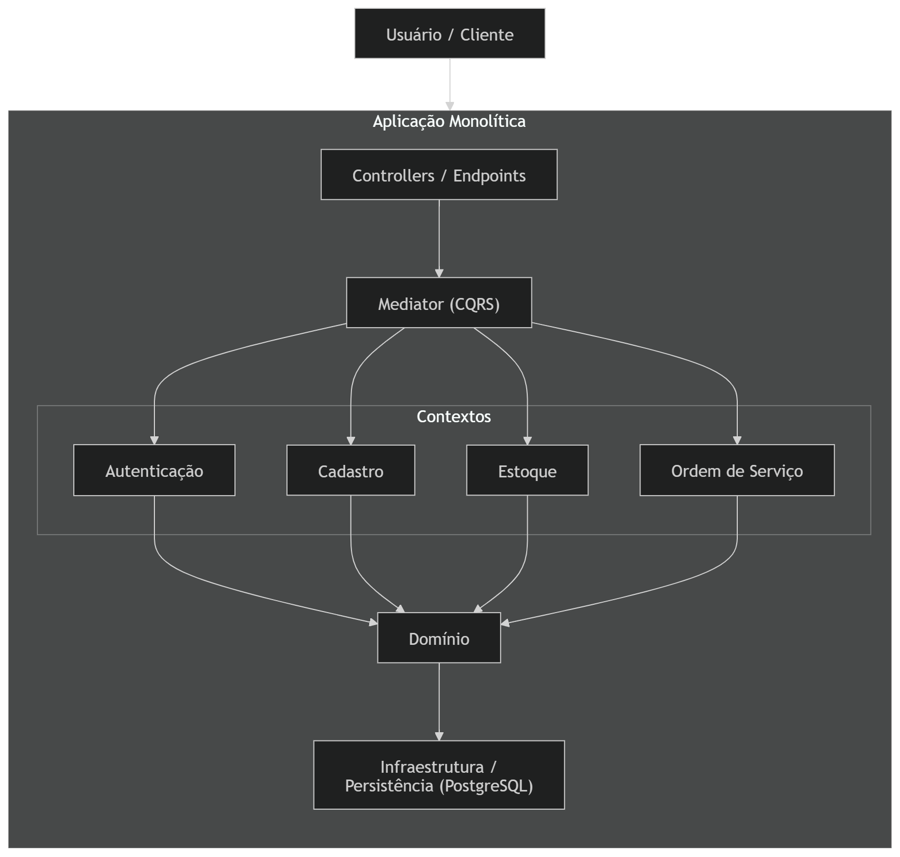
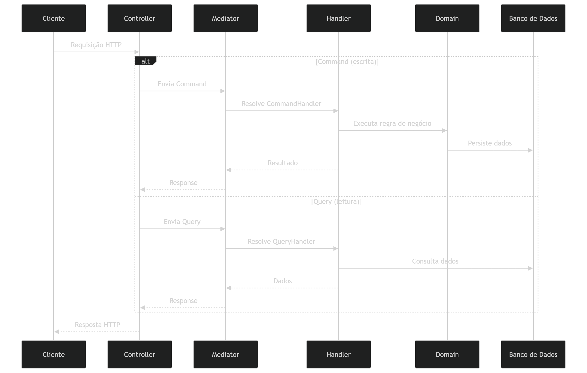
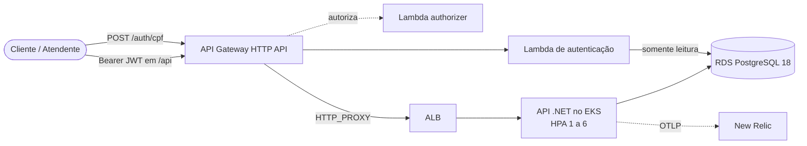

<div align="center">


# Projeto Chave Inglesa

**Sistema Integrado de Atendimento e Execução de Serviços** para a oficina _Wrench Auto Repair_, em
operação corporativa na nuvem: autenticação serverless por CPF com API Gateway, aplicação em
Kubernetes com autoescala, banco gerenciado e observabilidade completa.

<br>


FIAP · Pós-Tech · 13SOAT · Tech Challenge — Fase 3 · Grupo **BGT³**

[**🗂️ C4 Model**](https://structurizr-wrench-api.bgt3.com.br/workspace/1) &nbsp;·&nbsp; [**📚 API (OpenAPI)**](https://api.bgt3.com.br/docs-ui) &nbsp;·&nbsp; [**🏛️ Arquitetura**](./infraestrutura/arquitetura.md) &nbsp;·&nbsp; [**📋 Miro (DDD)**](https://miro.com/app/board/uXjVGuaIszk=/?share_link_id=188169996234) &nbsp;·&nbsp; [**📦 Postman**](./postman/wrench.postman_collection.json)

</div>

---

## Índice

- [Sobre esta Fase (Fase 3)](#sobre-esta-fase-fase-3)
  - [O que compõe esta fase](#o-que-compõe-esta-fase)
  - [APIs de Ordem de Serviço](#apis-de-ordem-de-serviço)
- [Participantes](#participantes)
- [O Contexto do Negócio](#o-contexto-do-negócio)
- [Arquitetura](#arquitetura)
  - [Componentes da Aplicação](#componentes-da-aplicação)
  - [CQRS com Mediator](#cqrs-com-mediator)
  - [Visão de nuvem](#visão-de-nuvem)
  - [Autenticação por CPF](#autenticação-por-cpf)
  - [Observabilidade](#observabilidade)
  - [Repositórios e entrega](#repositórios-e-entrega)
- [API](#api)
- [Como Executar](#como-executar)
- [Documentação](#documentação)

---

## Sobre esta Fase (Fase 3)

A oficina expandiu para múltiplas unidades e a base de clientes cresce continuamente. A Fase 3 eleva
o sistema a um nível de operação corporativa, com os objetivos definidos pela direção:

- **Controlar acessos e autenticações com segurança** — clientes se autenticam por CPF em uma função
  serverless, e as rotas da aplicação são protegidas na borda por um API Gateway.
- **Monitorar o ambiente e detectar gargalos em tempo real** — traces, métricas, logs correlacionados,
  dashboards e alertas no New Relic.
- **Adotar soluções serverless** para autenticação.
- **Segregar a aplicação em repositórios organizados** com CI/CD completo e branches protegidas.
- **Documentar a modelagem do banco de dados**, garantindo consistência e performance.

### O que compõe esta fase

| Frente | Entrega |
|---|---|
| **Autenticação serverless** | Lambda que valida o CPF, consulta existência e status do cliente e emite JWT; Lambda authorizer; API Gateway HTTP API na frente do ALB. |
| **Repositórios** | `lambda-auth`, `infra-k8s`, `infra-db` e `app-k8s`, cada um com pipeline próprio, `master` protegida e Pull Request obrigatório. |
| **Ambientes** | `develop` implanta homologação e `master` implanta produção, separados por namespace, release e gateway. |
| **Infraestrutura** | EKS com HPA, RDS PostgreSQL 18, API Gateway, Lambda, ECR, SES e DNS, tudo em Terraform com estado no HCP. |
| **Observabilidade** | Serilog em JSON com `CorrelationId`, OpenTelemetry via OTLP, `nri-bundle` no cluster, dashboards, alertas e synthetic monitor como código. |
| **Documentação** | Diagrama de componentes, diagramas de sequência, RFCs, ADRs e modelo relacional com diagrama ER. |

### APIs de Ordem de Serviço

- **Abertura de OS** — recebe dados de cliente, veículo, serviços e peças e retorna a identificação única da OS.
- **Consulta de status** — informa a situação atual: _Recebida → Diagnóstico → Aguardando Aprovação → Execução → Finalizada → Entregue_.
- **Aprovação de orçamento** — o cliente autenticado por CPF aprova ou recusa o orçamento.
- **Listagem de OS** — ordenada por status (_Execução → Aguardando Aprovação → Diagnóstico → Recebida_) e, dentro do status, mais antigas primeiro; OS finalizadas e entregues não aparecem na listagem.
- **Atualização de status** — notifica o cliente por e-mail (Amazon SES) a cada mudança de status.
- **Monitoramento** — tempo médio de execução das ordens.

---

## Participantes

| Nome                                    | Matrícula | E-mail                      | Discord           |
| --------------------------------------- | --------- | --------------------------- | ----------------- |
| Thiago Rodrigues Ribeiro Santana Santos | RM 370291 | thiago_santos14@hotmail.com | thiagoribeiro0611 |
| Bruno da Cruz Barreto                   | RM 370310 | brunocbarreto2012@gmail.com | bbarreto08        |
| João Paulo Seixas                       | —         | —                           | —                 |

---

## O Contexto do Negócio

A **Wrench Auto Repair** é uma oficina que cresceu de um galpão de um único mecânico para uma operação com mais de uma dezena de funcionários, parcerias com seguradoras e uma base fiel de clientes. Com o crescimento, o controle manual em cadernos e planilhas deixou de dar conta: peças sumiam do estoque, o status dos serviços se perdia e orçamentos eram esquecidos. O **Projeto Chave Inglesa** nasce para digitalizar toda a jornada de atendimento — da chegada do cliente até a entrega do veículo com o serviço concluído.

<details>
<summary><strong>📖 A história completa da Wrench Auto Repair</strong> (clique para expandir)</summary>

<br>

### As origens

Era 2003, em uma cidade do interior paulista, quando Roberto Mendes, então com 28 anos, decidiu transformar sua paixão por motores em negócio. Com as mãos calejadas de anos trabalhando como mecânico em oficinas alheias e algumas economias guardadas a duras penas, ele alugou um galpão pequeno na Rua dos Ipês, comprou um elevador hidráulico usado e pendurou uma placa artesanal na fachada:

> **"Wrench — Consertos com Honestidade"**

O nome veio do inglês mesmo, uma homenagem ao pai, que passava os finais de semana lendo revistas americanas de automobilismo e sempre dizia que uma boa chave de boca — a _wrench_ — era o símbolo do mecânico honesto: simples, confiável e essencial.

Nos primeiros anos, Roberto trabalhava sozinho. Conhecia cada cliente pelo nome, lembrava do histórico de cada carro de cabeça e anotava tudo num caderno azul surrado que ficava sobre o balcão. A qualidade do trabalho correu de boca em boca, e a fila de espera começou a crescer.

### A expansão

Em 2010, Roberto contratou seus primeiros dois mecânicos: Davi, especialista em motores a diesel, e Juliana, a primeira mulher mecânica da cidade, com um talento impressionante para diagnósticos elétricos. A dupla trouxe nova energia à oficina.

O galpão pequeno foi trocado por um espaço maior na Avenida Industrial. A placa ganhou um novo visual, e o nome evoluiu para o que é hoje: **Wrench Auto Repair**. Com isso vieram mais clientes, mais serviços, mais peças em estoque — e também mais desafios. O caderno azul do Roberto não era mais suficiente.

### Os problemas crescem com o negócio

Em 2018, a Wrench Auto Repair já contava com 12 funcionários, uma frota de clientes fidelizados e parcerias com seguradoras locais. Mas por dentro, a operação começava a ranger — como um motor sem revisão.

Peças sumiam do estoque sem explicação. Clientes ligavam perguntando o status do carro e ninguém sabia responder com precisão. Orçamentos eram esquecidos em gavetas. Uma vez, um cliente retirou o carro sem que o serviço tivesse sido concluído — simplesmente porque ninguém tinha anotado que ainda faltava a troca do filtro de ar.

Roberto começou a chegar mais cedo e sair mais tarde, apagando incêndios que poderiam ser evitados. Certa noite, sentado na oficina vazia com uma xícara de café frio, ele olhou para o caderno azul — agora o quinto de uma série — e disse em voz alta:

> "Até quando?"

### A virada

Foi a filha de Roberto, Camila Mendes, recém-formada em Sistemas de Informação, quem trouxe a resposta. Ela convenceu o pai de que a oficina precisava de mais do que planilhas improvisadas — precisava de um sistema integrado, robusto e feito sob medida para a realidade da Wrench.

Com o apoio de uma equipe de desenvolvedores, o projeto foi batizado internamente de **"Projeto Chave Inglesa"** — uma brincadeira com o nome da oficina — e o desenvolvimento do back-end do sistema começou. A proposta era clara: digitalizar cada etapa do atendimento, desde o momento em que o cliente chega com o carro até a entrega das chaves com o serviço concluído.

### Muitas unidades

Com o sistema no ar, a Wrench abriu novas unidades e a base de clientes passou a crescer mês a mês. A direção precisava que o cliente acompanhasse o próprio serviço com segurança, que a operação resistisse aos picos de atendimento e que problemas fossem vistos antes de o cliente reclamar — o que levou à autenticação por CPF, à borda protegida e à observabilidade completa.

</details>

---

## Arquitetura

O sistema é um **monólito modular** organizado em **bounded contexts**, cercado por uma borda
serverless de autenticação. O código é estruturado em contextos bem definidos, o que facilita
manutenção, evolução e uma possível extração futura para microsserviços.

### Componentes da Aplicação

<div align="center">
  
</div>

> 🗂️ Diagrama interativo completo disponível no **[C4 Model (Structurizr)](https://structurizr-wrench-api.bgt3.com.br/workspace/1)**, gerado a partir de [`workspace.dsl`](./infraestrutura/structurizr/workspace.dsl).

| Contexto             | Responsabilidade                                                                 |
| -------------------- | -------------------------------------------------------------------------------- |
| **Autenticação**     | Controle de acesso, login por e-mail e senha, gestão de usuários e perfis.       |
| **Cadastro**         | Entidades centrais do sistema: clientes, veículos e demais dados cadastrais.     |
| **Estoque**          | Peças, insumos e movimentações de inventário.                                    |
| **Ordem de Serviço** | Núcleo operacional: criação, acompanhamento e finalização das ordens de serviço. |

### CQRS com Mediator

O projeto adota **CQRS (Command Query Responsibility Segregation)** em conjunto com um **mediator** para orquestração das operações, separando escrita e leitura:

- **Commands** — operações de escrita (criação, atualização, remoção).
- **Queries** — operações de leitura.

O mediator centraliza o fluxo de execução, desacopla os controllers dos handlers de negócio e viabiliza pipelines transversais (validação, logging, transações):

```
Controller → Command/Query → Mediator → Handler → Domínio/Infraestrutura
```

<div align="center">
  
</div>

### Visão de nuvem



O diagrama de componentes completo — Cloudflare, ACM, ECR, SES, namespaces, `nri-bundle`,
dashboards, alertas e synthetic monitor — está em
[`infraestrutura/arquitetura.md`](./infraestrutura/arquitetura.md).

### Autenticação por CPF

1. O cliente envia o CPF para `POST /auth/cpf` no API Gateway.
2. A Lambda valida os dígitos, localiza o cliente e o usuário vinculado, recusa usuário inativo e
   devolve um JWT com o perfil `Cliente`.
3. Nas chamadas a `/api`, o Lambda authorizer valida o token antes de o gateway encaminhar ao ALB.
4. A API revalida o token e aplica as roles de cada endpoint.

Funcionários e administradores continuam autenticando por e-mail e senha na própria API. Fluxo
completo no [diagrama de sequência](./diagramas/sequencia-autenticacao.md) e decisões no
[RFC 002](./rfcs) e no [ADR 006](./adrs).

### Observabilidade

| Requisito | Onde é atendido |
|---|---|
| Latência das APIs | Traces OpenTelemetry por rota |
| CPU e memória do Kubernetes | `nri-bundle` no cluster |
| Healthchecks e uptime | `/health` e `/health/ready`, synthetic monitor do New Relic |
| Alertas de falha no processamento de OS | Métrica `ordemservico.processamento.falhas` e alert policy |
| Logs JSON com correlação | Serilog com `CorrelationId`, `TraceId` e `SpanId` |
| Volume diário de OS, tempo médio por status, erros de integração | Dashboards do New Relic |

Decisão de ferramenta no [ADR 003](./adrs/ADR%20003%20-%20Observabilidade%20com%20New%20Relic.md) e
queries em [dashboards NRQL](./observability/dashboards-nrql.md).

### Repositórios e entrega

| Repositório | Conteúdo | Deploy |
|---|---|---|
| `lambda-auth` | Lambdas de autenticação e authorizer, API Gateway | `develop` → homologação, `master` → produção |
| `infra-k8s` | VPC, EKS, ACM, ECR, SES, DNS, Structurizr, `nri-bundle`, New Relic como código | `master` → `apply` |
| `infra-db` | RDS PostgreSQL e roles | `master` → `apply` |
| `app-k8s` | API .NET, chart Helm, documentação | `develop` → homologação, `master` → produção |

Todos exigem Pull Request para a `master`. Valores entre repositórios são lidos por remote state do
HCP Terraform. Pipelines detalhados em [`infraestrutura/ci-cd.md`](./infraestrutura/ci-cd.md).

---

## API

A API é documentada via **OpenAPI (Scalar)**:

- **Ambiente local:** http://localhost:8080/docs-ui
- **Produção:** https://api.bgt3.com.br/docs-ui
- **Homologação:** https://hml-api.bgt3.com.br/docs-ui

A API é **versionada pela URL**. Em cada endpoint, na seção **"Variables"** da UI, informe o parâmetro obrigatório `version` com o valor `1`. Os endpoints protegidos exigem `Authorization: Bearer <token>`, obtido pela Lambda de autenticação (clientes, por CPF) ou por `POST /api/v1/autenticacao` (funcionários e administradores). A aplicação cria um usuário administrador inicial:

| Usuário                   | Senha                        |
| ------------------------- | ---------------------------- |
| valor de `ADMIN_EMAIL`    | valor de `ADMIN_PASSWORD`    |

As duas credenciais **não são versionadas**: em produção vêm dos secrets do pipeline; localmente,
do arquivo `.env` (ver `.env.example` na raiz do repositório).

> ⚠️ **Antes de testar: verifique o e-mail no Amazon SES**
>
> O Amazon SES opera em **modo _sandbox_** e só entrega e-mails a endereços **previamente cadastrados e verificados** no console da AWS. Para exercitar os fluxos que disparam notificação (ex.: **atualização de status da OS**), é preciso **cadastrar e verificar o e-mail de destino _antes_ de iniciar os testes da API**.

Para facilitar a avaliação, disponibilizamos abaixo credenciais de acesso ao console AWS com permissão para **adicionar e verificar** os endereços que receberão as notificações. O passo a passo:

1. Acesse o console AWS com as credenciais abaixo.
2. Em **Amazon SES → Identities → Create identity**, cadastre o e-mail que será usado como destinatário nos testes.
3. **Confirme o cadastro clicando no link de verificação que a Amazon envia** para esse e-mail logo após o registro — sem essa confirmação, as notificações não são entregues.

```
Account ID: --
Usuário: --
Senha: --
```

---

## Como Executar

> **Pré-requisitos:** Docker e Docker Compose (execução local); AWS CLI, Terraform, `kubectl` e Helm (deploy manual em nuvem).

### Execução local

```bash
cp .env.example .env          # preencha JWT_SIGNING_KEY e ADMIN_PASSWORD
docker compose -f wrench.auto.repair/scripts/docker-compose.yml up -d
```

Aguarde até que o log exiba `Now listening on: http://[::]:8080`. As _migrations_ rodam na subida.
Em seguida, acesse **http://localhost:8080/docs-ui**.

### Provisionamento

A infraestrutura é aplicada pelos pipelines dos repositórios `infra-k8s`, `infra-db` e
`lambda-auth`; cada README descreve os comandos equivalentes para execução manual. A ordem do
primeiro provisionamento está em [`infraestrutura/arquitetura.md`](./infraestrutura/arquitetura.md#ordem-do-primeiro-provisionamento).

### Deploy manual em Kubernetes

```bash
aws eks update-kubeconfig --name eks-wrench-auto-repair --region us-east-1

helm upgrade --install wrench ./wrench-api-k8s \
  --namespace production --create-namespace \
  --set api.image.repository=<ECR_API_REPO> \
  --set api.image.tag=<TAG> \
  --set database.host=<DB_HOST> \
  --set database.user=<APP_DB_USER> \
  --set database.password=<APP_DB_PASSWORD> \
  --set jwt.signingKey=<JWT_SIGNING_KEY> \
  --set application.admin.password=<ADMIN_PASSWORD> \
  --set newRelic.licenseKey=<NEW_RELIC_LICENSE_KEY>
```

O chart cria `Deployment`, `Service`, `HPA` (1–6 réplicas por CPU), `Gateway`, rotas e os secrets
`db-credentials` e `newrelic-credentials`, e falha se `jwt.signingKey` ou
`application.admin.password` vierem vazios. Os manifestos equivalentes estão em
[`../kubernetes/reference`](../kubernetes/reference/README.md).

### Testes

```bash
docker compose -f wrench.auto.repair/scripts/docker-compose.test.yml up --abort-on-container-exit
```

Roda os testes unitários e, na sequência, os de integração, gerando cobertura em `TestResults`.

---

## Documentação

| Documento | Descrição |
| --- | --- |
| [🏛️ Diagrama de componentes](./infraestrutura/arquitetura.md) | Visão de nuvem, APIs, banco e monitoramento. |
| [🔐 Sequência — autenticação](./diagramas/sequencia-autenticacao.md) | Autenticação por CPF e consumo de rota protegida. |
| [🧾 Sequência — abertura de OS](./diagramas/sequencia-abertura-ordem-servico.md) | Da borda autenticada à notificação por e-mail. |
| [🗄️ Modelo relacional](./database/modelo-relacional.md) | Justificativa do banco, diagrama ER e relacionamentos. |
| [📝 ADRs](./adrs) | Decisões arquiteturais permanentes (banco, observabilidade, HPA, comunicação, authorizer). |
| [💬 RFCs](./rfcs) | Decisões técnicas (nuvem, autenticação, banco de dados). |
| [📈 Dashboards NRQL](./observability/dashboards-nrql.md) | Queries dos painéis de observabilidade. |
| [🔁 Pipeline de CI/CD](./infraestrutura/ci-cd.md) | Workflows, ambientes e ordem de provisionamento. |
| [🧭 Pipeline HTTP](./infraestrutura/pipeline-http.md) | Ordem dos middlewares e healthchecks. |
| [🗂️ C4 Model](https://structurizr-wrench-api.bgt3.com.br/workspace/1) | Visualização interativa da arquitetura (Structurizr). |
| [📚 API (OpenAPI / Scalar)](https://api.bgt3.com.br/docs-ui) | Collection completa dos endpoints da API. |
| [📦 Postman](./postman/wrench.postman_collection.json) | Collection Postman dos endpoints. |
| [📋 Board no Miro](https://miro.com/app/board/uXjVGuaIszk=/?share_link_id=188169996234) | Documentação DDD: linguagem pictográfica, jornadas AS-IS/TO-BE, contextos delimitados, event storming e mapa de contexto. |
| [📖 Linguagem Ubíqua](./linguagem-ubiqua/linguage-ubiqua.md) | Glossário do domínio. |
| [🗄️ Banco de Dados — Setup AWS/RDS](./database/AWS%20-%20Postgres%20setup.md) | Configuração do PostgreSQL no Amazon RDS. |
| [🎬 Vídeo de demonstração FASE 1](https://www.youtube.com/watch?v=gTRRVQVVjiE) | Demonstração do funcionamento da API. |
| [🎬 Vídeo de demonstração FASE 2](https://www.youtube.com/watch?v=929h6rjSDOw) | Deploy, CI/CD, consumo das APIs e escalabilidade automática. |
| [🔎 Cobertura de Testes](https://euthribeiro.github.io/tech-challange-fiap-fase-1/wrench.auto.repair/coverage-report/index.html) | Relatório de cobertura (xUnit). |
| [🛡️ Relatório SonarQube](./sonar/relatorio-sonar-qube-wrench-auto-repair-api.pdf) | Análise estática de qualidade. |
| [🔒 OWASP Dependency Check](https://euthribeiro.github.io/tech-challange-fiap-fase-1/docs/owasp/dependency-check-report.html) | Verificação de vulnerabilidades em dependências. |
| [📑 Roteiro da API](./como-utilizar.md) | Guia de apoio para uso dos endpoints. |

---

<div align="center">

Distribuído sob a licença descrita em [LICENSE.md](../LICENSE.md).

Feito com ☕ pelo Grupo **BGT³** — FIAP Tech Challenge

</div>
